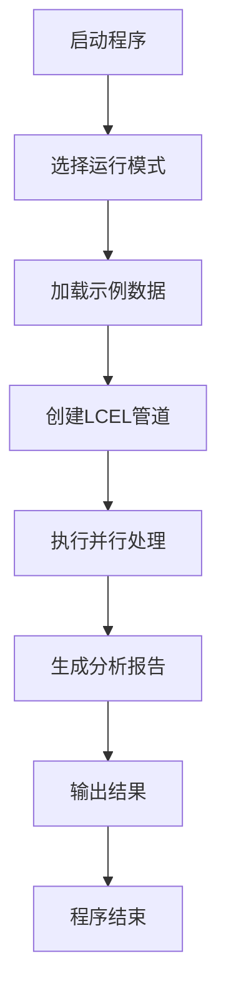
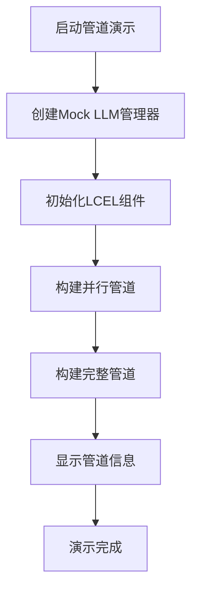
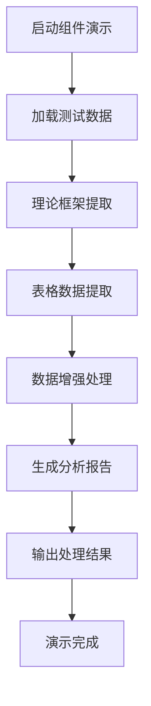
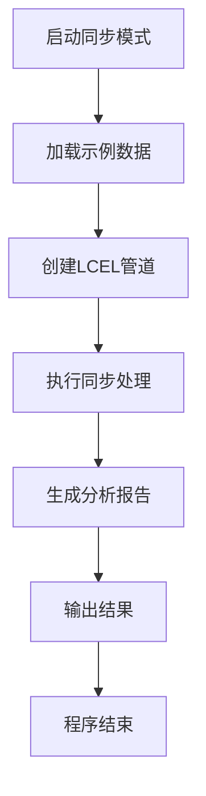
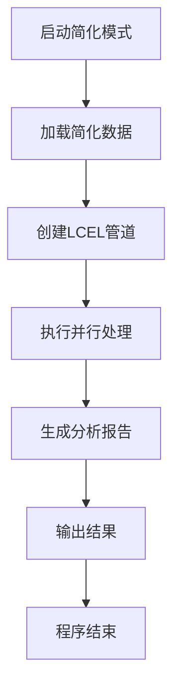

# LCEL演示程序业务流程文档

## 📋 文档概述

本文档详细描述了LCEL演示程序的业务流程设计，包括业务场景、操作流程、数据流转和用户交互等各个方面。

## 🎯 业务场景定义

### 核心业务场景

#### 1. 学术论文分析
- **目标**: 从学术论文中提取理论框架和表格数据，生成分析报告
- **输入**: 包含理论和表格的学术文本
- **输出**: 结构化的理论分析和数据解读报告
- **用户**: 研究人员、学生、学术工作者

#### 2. 文档内容提取
- **目标**: 从复杂文档中识别和提取结构化信息
- **输入**: 包含多种内容类型的文档
- **输出**: 分类整理的信息摘要
- **用户**: 内容分析师、文档处理人员

#### 3. 数据洞察生成
- **目标**: 基于文本和表格数据生成业务洞察
- **输入**: 业务报告、数据表格
- **输出**: 数据分析和建议报告
- **用户**: 业务分析师、决策者

### 业务价值

1. **效率提升**: 自动化处理大量文档，节省人工时间
2. **质量保证**: 标准化的分析流程，确保结果一致性
3. **深度分析**: LLM驱动的智能解读，提供深度洞察
4. **可扩展性**: 模块化设计，支持多种业务场景

## 🔄 核心业务流程

### 主要业务流程图

```
┌─────────────────┐    ┌─────────────────┐    ┌─────────────────┐
│   输入阶段      │    │   处理阶段      │    │   输出阶段      │
├─────────────────┤    ├─────────────────┤    ├─────────────────┤
│ 1. 内容输入     │───▶│ 2. 并行提取     │───▶│ 3. 报告生成     │
│ 2. 格式验证     │    │ 3. 数据增强     │    │ 4. 结果输出     │
│ 3. 预处理       │    │ 4. 质量检查     │    │ 5. 格式转换     │
└─────────────────┘    └─────────────────┘    └─────────────────┘
```

### 详细业务流程

#### 阶段1: 输入阶段 (Input Phase)

##### 1.1 内容输入
- **操作**: 用户提供包含理论和表格的文本内容
- **输入源**: 
  - 直接文本输入
  - 示例数据文件
  - 简化测试数据
- **验证规则**:
  - 内容非空检查
  - 格式基本验证
  - 长度合理性检查

##### 1.2 格式验证
- **操作**: 验证输入内容的格式和结构
- **检查项目**:
  - 文本编码格式
  - 表格标记完整性
  - 内容结构合理性
- **异常处理**: 格式错误时提供友好提示

##### 1.3 预处理
- **操作**: 对输入内容进行标准化处理
- **处理步骤**:
  - 文本清理和标准化
  - 表格边界识别
  - 内容分段处理

#### 阶段2: 处理阶段 (Processing Phase)

##### 2.1 并行提取
- **操作**: 同时执行理论提取和表格提取
- **并行策略**:
  - 理论提取器独立工作
  - 表格提取器独立工作
  - 异步并发执行
- **性能优势**: 减少总体处理时间

##### 2.2 数据增强
- **操作**: 使用LLM增强提取的数据
- **增强内容**:
  - 理论框架深度解读
  - 表格数据智能分析
  - 关键发现识别
- **质量提升**: 提供更丰富的分析内容

##### 2.3 质量检查
- **操作**: 验证处理结果的质量和完整性
- **检查项目**:
  - 数据完整性
  - 格式一致性
  - 内容相关性
- **异常处理**: 质量不达标时进行修正

#### 阶段3: 输出阶段 (Output Phase)

##### 3.1 报告生成
- **操作**: 整合所有处理结果生成最终报告
- **生成策略**:
  - 结构化报告模板
  - 多源数据融合
  - 逻辑关系梳理
- **输出格式**: Markdown格式，便于阅读和编辑

##### 3.2 结果输出
- **操作**: 将生成的报告输出给用户
- **输出方式**:
  - 控制台显示
  - 文件保存
  - 格式化打印
- **用户反馈**: 提供处理结果摘要

##### 3.3 格式转换
- **操作**: 根据需要转换输出格式
- **支持格式**:
  - 纯文本
  - Markdown
  - 结构化数据
- **扩展性**: 支持自定义输出格式

## 🚀 操作流程详解

### 标准操作流程

#### 流程1: 完整分析流程



**详细步骤**:

1. **启动程序**
   - 执行: `poetry run python run_demo.py`
   - 输出: 程序启动信息和参数说明

2. **选择运行模式**
   - 默认: 异步模式
   - 可选: 同步模式 (`--sync`)
   - 可选: 详细模式 (`--verbose`)

3. **加载示例数据**
   - 标准数据: 完整的社会懈怠理论文本
   - 简化数据: 精简版测试内容 (`--simple`)

4. **创建LCEL管道**
   - 并行管道: 理论提取 + 表格提取
   - 串行管道: 并行结果 → 报告生成

5. **执行并行处理**
   - 理论提取: 识别理论框架章节
   - 表格提取: 解析表格结构和内容
   - 并发执行: 同时处理两个任务

6. **生成分析报告**
   - 数据整合: 合并理论和表格结果
   - 内容生成: 使用LLM生成结构化报告
   - 格式优化: 确保输出格式规范

7. **输出结果**
   - 控制台显示: 处理结果摘要
   - 详细输出: 完整报告内容 (详细模式)
   - 性能统计: 处理时间和资源使用

#### 流程2: 管道构建演示



**详细步骤**:

1. **启动管道演示**
   - 执行: `poetry run python run_demo.py --pipeline-only`
   - 目的: 展示LCEL管道构建过程

2. **创建Mock LLM管理器**
   - 配置: 最大并发调用数 = 3
   - 设置: Mock延迟 = 0.1秒
   - 初始化: 异步信号量控制

3. **初始化LCEL组件**
   - TheoryExtractor: 理论提取器
   - TableExtractor: 表格提取器
   - ReportGenerator: 报告生成器

4. **构建并行管道**
   - 使用: `RunnableParallel`
   - 组合: 理论提取 + 表格提取
   - 特点: 真正的并行执行

5. **构建完整管道**
   - 组合: 并行管道 → 报告生成器
   - 操作符: 使用 `|` 连接
   - 输出: 字符串格式

6. **显示管道信息**
   - 类型信息: 管道组件类型
   - 配置信息: 输入输出模式
   - 结构信息: 管道组合方式

#### 流程3: 组件工作流程



**详细步骤**:

1. **启动组件演示**
   - 执行: `poetry run python run_demo.py --verbose`
   - 特点: 详细模式，展示组件工作流程

2. **加载测试数据**
   - 理论文本: 社会懈怠理论相关内容
   - 表格数据: Markdown格式的表格
   - 数据验证: 确保内容完整性

3. **理论框架提取**
   - 输入: 理论文本内容
   - 处理: 使用LLM识别理论结构
   - 输出: 结构化的理论框架

4. **表格数据提取**
   - 输入: 包含表格的文本内容
   - 处理: 自动识别表格边界和结构
   - 输出: 表格对象列表

5. **数据增强处理**
   - 理论增强: 深度解读理论内容
   - 表格增强: 智能分析表格数据
   - 并发处理: 异步执行增强任务

6. **生成分析报告**
   - 数据整合: 合并增强后的数据
   - 报告生成: 使用LLM生成结构化报告
   - 内容优化: 确保报告逻辑清晰

7. **输出处理结果**
   - 理论结果: 提取的理论框架摘要
   - 表格结果: 表格数据统计信息
   - 报告结果: 生成的分析报告预览

### 特殊操作流程

#### 流程4: 同步处理模式



**特点说明**:
- 使用: `poetry run python run_demo.py --sync`
- 执行方式: 同步调用，阻塞式处理
- 适用场景: 调试、单步执行、性能对比

#### 流程5: 简化数据模式



**特点说明**:
- 使用: `poetry run python run_demo.py --simple`
- 数据特点: 精简的测试内容，处理速度快
- 适用场景: 快速测试、功能验证、演示展示

## 📊 数据流转详解

### 数据流转图

```
输入数据流
    ↓
┌─────────────────────────────────────────────────────────┐
│                    数据预处理                            │
│  ┌─────────────┐  ┌─────────────┐  ┌─────────────┐    │
│  │ 文本清理    │  │ 格式验证    │  │ 内容分段    │    │
│  └─────────────┘  └─────────────┘  └─────────────┘    │
└─────────────────────────────────────────────────────────┘
    ↓
并行处理流
    ↓
┌─────────────────────────────────────────────────────────┐
│                    并行执行                             │
│  ┌─────────────┐                    ┌─────────────┐    │
│  │ 理论提取    │◄─── 异步并发 ────►│ 表格提取    │    │
│  └─────────────┘                    └─────────────┘    │
└─────────────────────────────────────────────────────────┘
    ↓
数据聚合流
    ↓
┌─────────────────────────────────────────────────────────┐
│                    数据整合                             │
│  ┌─────────────┐  ┌─────────────┐  ┌─────────────┐    │
│  │ 理论框架    │  │ 表格数据    │  │ 数据验证    │    │
│  └─────────────┘  └─────────────┘  └─────────────┘    │
└─────────────────────────────────────────────────────────┘
    ↓
报告生成流
    ↓
┌─────────────────────────────────────────────────────────┐
│                    报告生成                             │
│  ┌─────────────┐  ┌─────────────┐  ┌─────────────┐    │
│  │ 内容整合    │  │ 结构生成    │  │ 格式优化    │    │
│  └─────────────┘  └─────────────┘  └─────────────┘    │
└─────────────────────────────────────────────────────────┘
    ↓
输出数据流
```

### 数据转换过程

#### 1. 输入数据转换

**原始输入**:
```text
社会懈怠理论（Social Loafing Theory）是组织行为学中的一个重要概念...
| 变量 | 均值 | 标准差 | 显著性 |
|------|------|--------|--------|
| 组内 | 3.45 | 0.67   | p<0.01 |
```

**转换后**:
- 理论文本: 提取为纯文本内容
- 表格数据: 解析为结构化对象
- 元数据: 记录处理信息和时间戳

#### 2. 处理数据转换

**理论提取结果**:
```python
{
    "研究背景": ["社会懈怠理论是组织行为学中的重要概念..."],
    "核心假设": ["个体在群体中会减少努力..."],
    "研究方法": ["采用实验研究方法..."],
    "主要发现": ["群体规模与个体努力呈负相关..."]
}
```

**表格提取结果**:
```python
[
    TableData(
        title="变量分析表",
        headers=["变量", "均值", "标准差", "显著性"],
        rows=[["组内", "3.45", "0.67", "p<0.01"]],
        interpretation="数据表明组内差异显著..."
    )
]
```

#### 3. 输出数据转换

**最终报告**:
```markdown
# 社会懈怠理论分析报告

## 研究背景
社会懈怠理论是组织行为学中的一个重要概念...

## 数据发现
根据表格数据分析，组内差异显著（p<0.01）...

## 结论
该研究支持了社会懈怠理论的核心假设...
```

## 🎮 用户交互流程

### 交互模式

#### 1. 命令行交互

**启动交互**:
```bash
$ poetry run python run_demo.py
🚀 LCEL演示程序
============================================================
展示LangChain LCEL核心特性的简化实现
============================================================
```

**参数选择**:
```bash
$ poetry run python run_demo.py --help
usage: run_demo.py [-h] [--sync] [--simple] [--pipeline-only] [--verbose]

LCEL演示程序 - 展示LangChain LCEL核心特性

options:
  -h, --help        show this help message and exit
  --sync            使用同步模式
  --simple          使用简化数据
  --pipeline-only   仅演示管道构建
  --verbose, -v     显示详细输出
```

**运行反馈**:
```bash
🔧 创建LCEL管道...
⚡ 开始异步处理...
✅ 异步处理完成！耗时: 0.45秒
📊 输出结果长度: 1250 字符
```

#### 2. 程序输出交互

**进度显示**:
```
1️⃣ 理论框架提取
   提取的理论框架章节数: 5

2️⃣ 表格数据提取
   提取的表格数量: 2

3️⃣ 分析报告生成
   生成的报告长度: 1250 字符
```

**结果展示**:
```
📄 输出结果预览:
----------------------------------------
# 社会懈怠理论分析报告

## 研究背景
社会懈怠理论是组织行为学中的一个重要概念...
----------------------------------------
```

**错误处理**:
```
❌ 理论框架提取失败: 网络连接超时
⚠️ 使用默认理论框架
```

### 交互设计原则

#### 1. 用户友好性
- **清晰提示**: 使用emoji和格式化文本
- **进度反馈**: 实时显示处理进度
- **错误提示**: 友好的错误信息和解决建议

#### 2. 信息层次
- **概要信息**: 程序启动和基本状态
- **详细信息**: 处理过程和中间结果
- **调试信息**: 详细的错误和诊断信息

#### 3. 操作反馈
- **即时反馈**: 每个操作都有相应的反馈
- **状态指示**: 清楚显示当前处理状态
- **结果展示**: 清晰展示最终处理结果

## 🔧 业务流程配置

### 运行模式配置

#### 1. 默认模式
- **执行方式**: 异步处理
- **数据源**: 完整示例数据
- **输出级别**: 标准输出
- **适用场景**: 日常使用、功能验证

#### 2. 详细模式
- **执行方式**: 异步处理 + 组件流程
- **数据源**: 完整示例数据
- **输出级别**: 详细输出
- **适用场景**: 调试、学习、深入理解

#### 3. 同步模式
- **执行方式**: 同步处理
- **数据源**: 完整示例数据
- **输出级别**: 标准输出
- **适用场景**: 性能对比、单步调试

#### 4. 简化模式
- **执行方式**: 异步处理
- **数据源**: 简化测试数据
- **输出级别**: 标准输出
- **适用场景**: 快速测试、演示展示

#### 5. 管道演示模式
- **执行方式**: 仅构建管道
- **数据源**: 无数据处理
- **输出级别**: 管道信息
- **适用场景**: 架构学习、管道设计

### 性能配置

#### 1. 并发控制
```python
max_concurrent_calls = 3      # 最大并发LLM调用数
```

**配置说明**:
- 控制同时进行的LLM调用数量
- 平衡性能和资源使用
- 避免系统过载

#### 2. 延迟设置
```python
mock_delay = 0.1             # Mock延迟（秒）
```

**配置说明**:
- 模拟真实的网络延迟
- 便于观察异步处理效果
- 可调整以测试不同性能场景

#### 3. 重试策略
```python
max_retries: int = 1         # 最大重试次数
```

**配置说明**:
- 处理临时性错误
- 提高系统稳定性
- 避免无限重试循环

## 📈 业务流程监控

### 监控指标

#### 1. 性能指标
- **处理时间**: 总处理时间和各阶段耗时
- **并发数**: 实际并发执行的LLM调用数
- **资源使用**: 内存和CPU使用情况

#### 2. 质量指标
- **成功率**: 成功处理的请求比例
- **错误率**: 各种错误的出现频率
- **数据完整性**: 输出数据的完整程度

#### 3. 业务指标
- **处理量**: 单位时间内处理的文档数量
- **用户满意度**: 输出结果的质量评分
- **功能使用率**: 各种功能的使用频率

### 监控方式

#### 1. 实时监控
- **控制台输出**: 实时显示处理状态
- **进度指示**: 显示当前处理阶段
- **状态反馈**: 及时反馈操作结果

#### 2. 日志记录
- **操作日志**: 记录所有用户操作
- **错误日志**: 记录错误和异常信息
- **性能日志**: 记录性能相关数据

#### 3. 统计报告
- **运行统计**: 程序运行的基本统计信息
- **性能报告**: 详细的性能分析报告
- **使用报告**: 功能使用情况统计

## 🔮 业务流程优化

### 优化策略

#### 1. 性能优化
- **并发优化**: 增加并行处理组件
- **缓存策略**: 缓存中间处理结果
- **批量处理**: 批量处理相似任务

#### 2. 质量优化
- **错误处理**: 改进错误处理和恢复机制
- **数据验证**: 增强数据质量检查
- **结果优化**: 优化输出结果的质量

#### 3. 用户体验优化
- **交互优化**: 改进用户交互界面
- **反馈优化**: 提供更丰富的状态反馈
- **帮助系统**: 增加用户帮助和指导

### 扩展方向

#### 1. 功能扩展
- **数据源扩展**: 支持更多输入格式
- **输出扩展**: 支持更多输出格式
- **分析扩展**: 增加更多分析功能

#### 2. 集成扩展
- **外部系统**: 集成外部数据源和系统
- **API接口**: 提供REST API接口
- **Web界面**: 开发Web用户界面

#### 3. 部署扩展
- **容器化**: 支持Docker容器部署
- **云服务**: 支持云平台部署
- **分布式**: 支持分布式部署

## 🚨 业务流程注意事项

### 使用限制

#### 1. 功能限制
- **Mock环境**: 不包含真实的LLM调用
- **数据限制**: 仅支持预定义的示例数据
- **格式限制**: 输出格式相对固定

#### 2. 性能限制
- **并发限制**: 最大并发数固定为3
- **处理能力**: 受Mock LLM性能限制
- **扩展性**: 不支持水平扩展

#### 3. 稳定性限制
- **错误处理**: 错误处理相对简单
- **恢复机制**: 恢复机制有限
- **监控能力**: 监控和诊断能力有限

### 最佳实践

#### 1. 使用建议
- **学习目的**: 主要用于理解LCEL概念
- **开发参考**: 可作为开发参考模板
- **功能验证**: 用于验证基本功能

#### 2. 扩展建议
- **渐进扩展**: 逐步添加新功能
- **测试驱动**: 充分测试新功能
- **文档维护**: 及时更新相关文档

#### 3. 部署建议
- **环境隔离**: 使用虚拟环境隔离依赖
- **版本控制**: 严格控制依赖版本
- **监控部署**: 部署后及时监控运行状态

---

**文档版本**: 1.0  
**最后更新**: 2024年  
**维护者**: 开发团队
